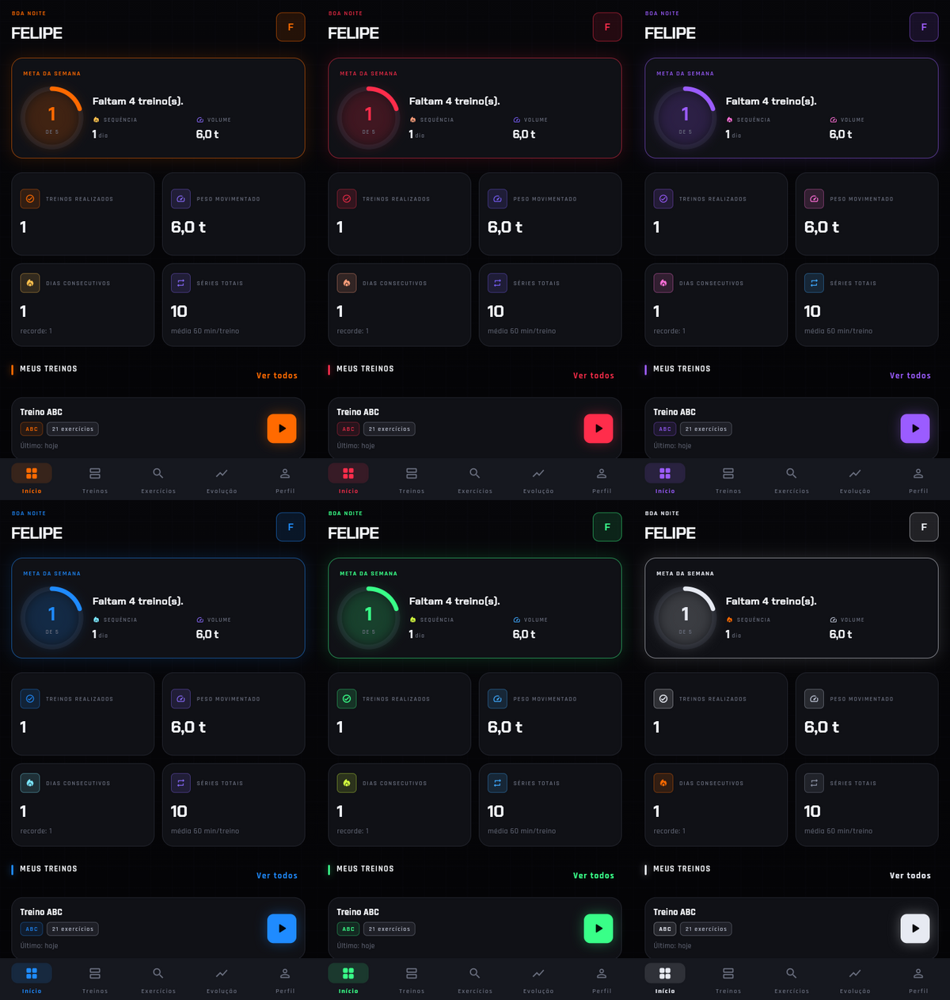
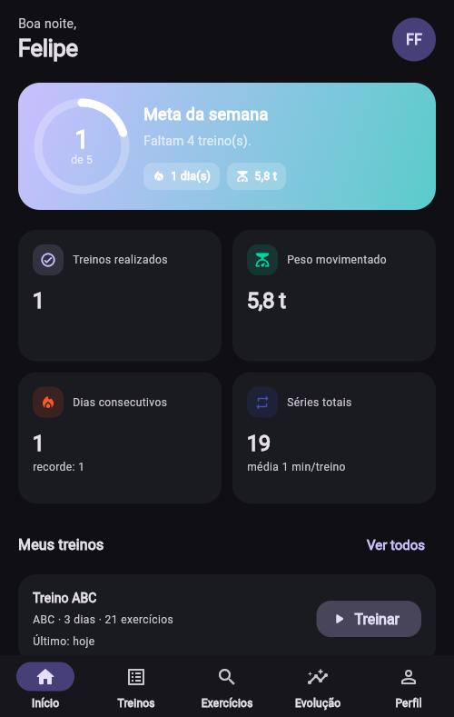
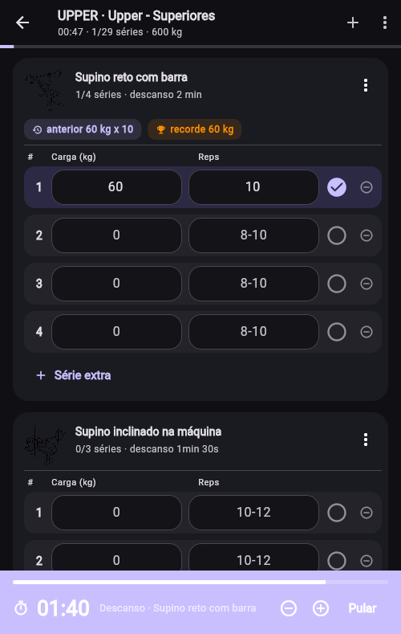
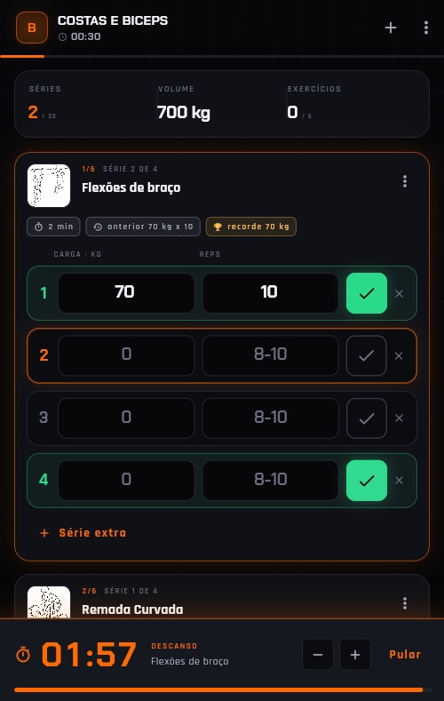
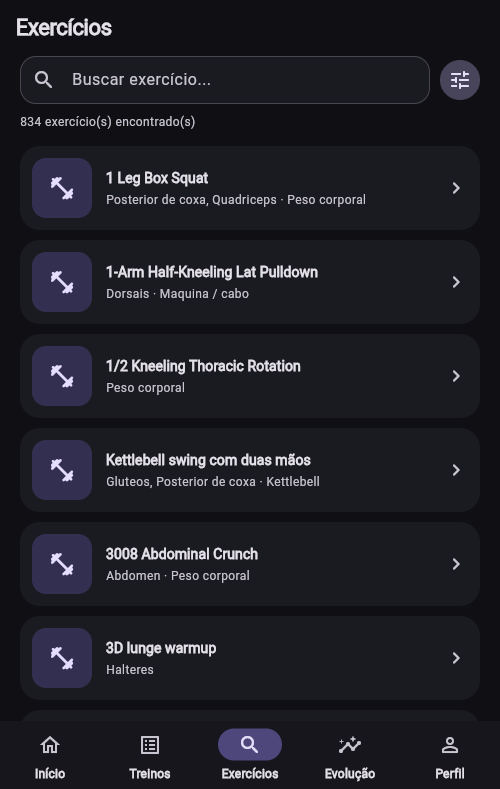
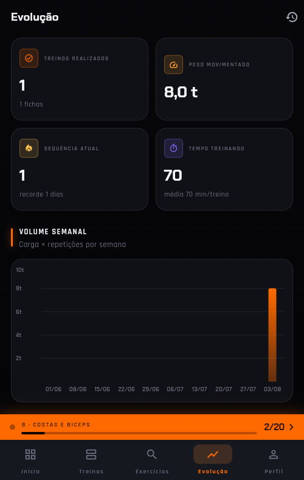
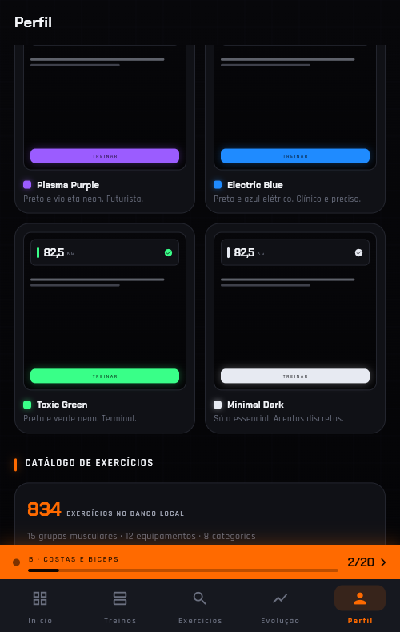

# Meu Treino

Aplicativo de musculação completo para uso pessoal: fichas de treino, execução da
sessão com cronômetro de descanso, histórico, evolução de carga e catálogo com
**834 exercícios** já dentro do banco (fonte: [wger](https://wger.de)).

Estética dark/sci-fi com laranja neon e **6 temas** trocáveis. Backend em
**Spring Boot + PostgreSQL**, app em **Flutter** (PWA no navegador do celular,
APK no Android). Tudo sobe com `docker compose`.



| Início | Treino em andamento | Cronômetro de descanso |
|---|---|---|
|  |  |  |

| Catálogo | Evolução | Aparência |
|---|---|---|
|  |  |  |

---

## Baixar

[](https://github.com/felipemacedo1/meu_treino/releases/latest)

- **Android:** [baixe o APK](https://github.com/felipemacedo1/meu_treino/releases/latest)
  (use o `meu-treino-x.y.z.apk` universal na dúvida). Depois de instalar, na tela
  de login toque em **Servidor** e aponte para a máquina onde a API está rodando.
- **iPhone / iPad:** abra `http://SEU_IP:8081` no Safari e use
  *Compartilhar → Adicionar à Tela de Início*.
- **Computador:** o app web já sobe junto com o `make up`.

O APK precisa que o backend esteja no ar em algum lugar — comece pela seção
abaixo.

## Começando (2 comandos)

```bash
git clone git@github.com:felipemacedo1/meu_treino.git
cd meu_treino
make up          # ou: bash scripts/start.sh
```

Pronto:

| O quê | Onde |
|---|---|
| App | http://localhost:8081 |
| API | http://localhost:8080/api |
| Swagger | http://localhost:8080/swagger-ui.html |
| Postgres | `localhost:5433` (`meutreino` / `meutreino`) |

Crie sua conta na primeira tela e siga o onboarding (peso, altura, objetivo,
experiência, dias disponíveis e tempo por treino).

> **Usando no celular:** o app é um PWA. Descubra o IP da sua máquina
> (`hostname -I`), acesse `http://SEU_IP:8081` pelo celular na mesma rede e use
> "Adicionar à tela inicial". Ele abre em tela cheia, como um app nativo.

### Requisitos

- Docker + Docker Compose v2
  (se você só tem o `docker-compose` v1 antigo: `bash scripts/install-compose-v2.sh`)
- Opcional: Flutter SDK — se estiver instalado, o `start.sh` compila o app
  localmente (segundos). Sem ele, o build acontece dentro do Docker (mais demorado
  na primeira vez, mas funciona igual).

---

## Comandos

```bash
make up        # sobe Postgres + API + app web
make down      # para tudo (dados do banco continuam no volume)
make logs      # logs da API   (make logs s=web para o nginx)
make db        # sobe só o Postgres
make api       # backend local via Maven (hot reload de dev)
make web       # app Flutter no Chrome em modo dev
make smoke     # teste de fumaça do backend (fluxo completo)
make build     # compila o jar e o bundle web
make sync e=email@x p=senha   # re-sincroniza o catálogo com o wger
make reset     # APAGA o banco e recria
```

---

## O que o app faz

**Login**
- Cadastro e login com JWT (60 dias), senha com BCrypt.

**Treinos (fichas)**
- Criar, editar, duplicar e excluir.
- Divisões prontas que já vêm com exercícios, séries, repetições e descanso
  preenchidos: **ABC, ABCD, ABCDE, Push Pull Legs, Upper/Lower e Full Body**.
- Editor com múltiplos dias, arrastar para reordenar, ajuste de séries,
  repetições, carga alvo, descanso e observações por exercício.

**Exercícios**
- 834 exercícios no banco local, com nome em português nos mais usados.
- Busca por nome + filtros por **músculo, equipamento e categoria**.
- Detalhe com imagens, vídeo (quando existe), descrição da execução,
  músculos principais e auxiliares, e o seu gráfico de evolução no exercício.

**Sessão de treino**
- Marcar séries concluídas, editar carga, repetições e RPE.
- Adicionar/remover séries extras no meio do treino.
- Editar descanso e observações por exercício.
- **Cronômetro de descanso** automático ao concluir uma série (+15s/−15s/pular).
- **Trocar exercício por um equivalente** — a troca vale só para aquela sessão,
  a ficha salva continua intacta.
- Treino livre (sem ficha), adicionando exercícios na hora.

**Histórico e evolução**
- Tudo é salvo: carga, repetições, séries, duração e volume de cada sessão.
- Carga anterior, melhor carga (recorde) e última execução aparecem no próprio
  treino, ao lado do exercício.
- Volume semanal, volume por grupo muscular, mapa de frequência (17 semanas),
  sequência de dias consecutivos, peso movimentado e evolução por exercício.

**Perfil**
- Peso, altura, IMC, objetivo, experiência, dias disponíveis, tempo por treino
  e meta semanal. Registro de peso corporal com gráfico.

**Aparência**
- Identidade dark/sci-fi com laranja neon, tipografia Chakra Petch + Rajdhani.
- **6 temas** trocáveis em Perfil → Aparência, com preview de cada um:
  Neon Orange (padrão), Cyber Red, Plasma Purple, Electric Blue, Toxic Green e
  Minimal Dark. A troca é imediata e a preferência acompanha sua conta.
- Design system com tokens semânticos: nenhuma cor hardcoded nas telas
  (detalhes em [docs/ARQUITETURA.md](docs/ARQUITETURA.md)).

---

## Arquitetura

```
meu_treino/
├── backend/                 API Spring Boot (Java 21)
│   └── src/main/
│       ├── java/com/meutreino/
│       │   ├── config/      segurança, JWT, CORS, OpenAPI, bootstrap
│       │   ├── security/    filtro JWT e emissão de token
│       │   ├── common/      erros, paginação, helpers
│       │   ├── user/        auth, perfil, peso corporal
│       │   ├── exercise/    catálogo, busca, equivalentes
│       │   ├── media/       proxy + cache local das mídias do wger
│       │   ├── wger/        client e sincronização do catálogo
│       │   ├── workout/     fichas, dias, templates de divisão
│       │   ├── session/     sessão de treino e histórico
│       │   └── stats/       estatísticas e progressão
│       └── resources/db/migration/   V1..V6 (Flyway)
├── app/                     App Flutter (web/PWA + Android)
│   └── lib/src/
│       ├── core/            api client, tema, rotas, formatadores
│       ├── models/          modelos de domínio
│       ├── data/            repositórios (uma classe por área da API)
│       ├── providers/       estado com Riverpod
│       ├── features/        uma pasta por tela
│       └── widgets/         componentes reutilizáveis
├── scripts/                 automação (start, logs, smoke test, sync…)
├── docker-compose.yml       db + api + web
└── Makefile
```

Decisões que valem explicar:

- **Clean Architecture só onde paga**: o backend é organizado por feature
  (controller → service → repository), sem camadas de abstração extra. O app
  separa `models / data / providers / features`, que é o suficiente para
  testar e trocar peças sem cerimônia.
- **O catálogo do wger já vem no banco** (migration `V3`, gerada por
  `scripts/generate_exercise_seed.py`). O app nunca depende da internet do wger
  para funcionar; o `POST /api/sync/wger` existe só para atualizar depois.
- **Mídias passam pelo backend** (`/api/media/{hash}`): na primeira vez a API
  baixa a imagem/vídeo do wger e guarda os bytes no Postgres. Depois disso as
  mídias são servidas localmente. Só URLs que existem no catálogo são aceitas,
  o que evita SSRF.
- **A troca de exercício é por sessão**: `session_exercises` guarda
  `exercise_id` e `original_exercise_id`, então o histórico registra o que foi
  realmente feito sem alterar a ficha.

---

## Banco de dados

Migrations Flyway em `backend/src/main/resources/db/migration`:

| Migration | O que faz |
|---|---|
| `V1__schema.sql` | tabelas de usuário, perfil, catálogo, treinos, sessões, séries |
| `V2__seed_catalog.sql` | 15 grupos musculares, 12 equipamentos, 8 categorias (com nomes em PT) |
| `V3__seed_exercises.sql` | 834 exercícios com imagens, vídeos, músculos e equipamentos |
| `V4__media_cache.sql` | cache de mídias |
| `V5__exercise_names_pt.sql` | tradução dos exercícios mais usados na academia |
| `V6__exercise_quality.sql` | ordenação do catálogo (traduzidos e ilustrados primeiro) |

Principais tabelas: `users`, `profiles`, `body_weights`, `exercises`,
`exercise_muscles`, `exercise_equipment`, `exercise_images`, `exercise_videos`,
`workouts`, `workout_days`, `workout_exercises`, `sessions`, `session_exercises`,
`session_sets`.

---

## API

Documentação interativa: http://localhost:8080/swagger-ui.html

| Método | Rota | Descrição |
|---|---|---|
| POST | `/api/auth/register` | cadastro |
| POST | `/api/auth/login` | login (retorna JWT) |
| GET | `/api/auth/me` | usuário logado |
| GET/PUT | `/api/profile` | perfil |
| GET/POST | `/api/profile/body-weights` | histórico de peso corporal |
| GET | `/api/exercises` | busca (`search`, `muscleId`, `equipmentId`, `categoryId`, `onlyWithImage`, `page`, `size`) |
| GET | `/api/exercises/catalog` | músculos, equipamentos e categorias |
| GET | `/api/exercises/{id}` | detalhe com imagens, vídeos e músculos |
| GET | `/api/exercises/{id}/equivalents` | exercícios equivalentes (troca) |
| GET | `/api/media/{hash}` | mídia em cache (público) |
| GET | `/api/workouts` | fichas do usuário |
| GET | `/api/workouts/splits` | divisões disponíveis |
| POST | `/api/workouts` | cria ficha |
| POST | `/api/workouts/from-template` | cria ficha a partir de uma divisão |
| GET/PUT/DELETE | `/api/workouts/{id}` | detalhe, edição e exclusão |
| POST | `/api/workouts/{id}/duplicate` | duplica |
| POST | `/api/sessions/start` | inicia sessão (`workoutId`, `workoutDayId`) |
| GET | `/api/sessions/active` | sessão em andamento (204 se não houver) |
| PATCH | `/api/sessions/{id}/sets/{setId}` | carga, reps, RPE, concluída |
| POST | `/api/sessions/{id}/exercises/{seId}/sets` | série extra |
| DELETE | `/api/sessions/{id}/sets/{setId}` | remove série |
| PATCH | `/api/sessions/{id}/exercises/{seId}` | descanso e observações |
| POST | `/api/sessions/{id}/exercises/{seId}/substitute` | troca o exercício na sessão |
| POST | `/api/sessions/{id}/exercises` | adiciona exercício à sessão |
| POST | `/api/sessions/{id}/finish` | finaliza |
| POST | `/api/sessions/{id}/cancel` | descarta |
| GET | `/api/sessions` | histórico paginado |
| GET | `/api/stats/overview` | resumo (treinos, volume, sequência…) |
| GET | `/api/stats/weekly-volume` | volume por semana |
| GET | `/api/stats/muscle-groups` | volume por grupo muscular |
| GET | `/api/stats/exercise/{id}` | evolução de um exercício |
| GET | `/api/stats/calendar` | frequência por dia |
| POST | `/api/sync/wger` | sincroniza o catálogo |
| GET | `/api/sync/status` | status da sincronização |

O teste de fumaça `scripts/smoke-test.sh` exercita esse fluxo inteiro
(cadastro → ficha → treino → troca de exercício → histórico → estatísticas).

---

## Desenvolvimento

```bash
make db      # Postgres em localhost:5433
make api     # backend com Maven (localhost:8080)
make web     # Flutter no Chrome, apontando para localhost:8080
```

Variáveis de ambiente ficam em `.env` (criado a partir de `.env.example`):
portas, credenciais do banco, `JWT_SECRET`, CORS e configuração do wger.

### Android (APK)

```bash
bash scripts/build-apk.sh              # usa o IP desta máquina como padrão
bash scripts/build-apk.sh 192.168.0.8:8080
```

Sai em `dist/`: um APK universal e um por arquitetura (menores). O endereço da
API é só o **padrão** — dentro do app, na tela de login, em **Servidor**, você
troca para onde quiser sem recompilar.

Para assinar com chave de release (recomendado, permite instalar atualizações
por cima):

```bash
keytool -genkeypair -v -keystore ~/.android/meu-treino-release.jks \
  -storetype JKS -keyalg RSA -keysize 2048 -validity 10950 -alias meu-treino
```

Crie `app/android/key.properties` (não versionado):

```properties
storeFile=/home/SEU_USUARIO/.android/meu-treino-release.jks
storePassword=...
keyAlias=meu-treino
keyPassword=...
```

Guarde o keystore: sem ele não é possível publicar atualizações que instalem
sobre esta versão. Sem o arquivo, o build cai na chave de debug.

### iOS

Não há build de iOS neste repositório pronto para instalar: gerar `.ipa` exige
**macOS com Xcode** e conta de desenvolvedor Apple. A pasta `app/ios` está
configurada (nome, status bar clara, acesso à rede local), então em um Mac:

```bash
cd app && flutter build ipa --dart-define=API_BASE_URL=http://SEU_IP:8080/api
```

O caminho prático no iPhone é o **PWA**: abra o app no Safari e use
*Compartilhar → Adicionar à Tela de Início*. Abre em tela cheia, com ícone.

---

## Deploy gratuito

Guia completo com os números reais do projeto e as pegadinhas de cada free tier
em **[docs/DEPLOY.md](docs/DEPLOY.md)**.

Se você tem o **GitHub Student Pack**, o caminho já vem pronto no repositório —
API no Azure Container Apps, banco no Neon e app no Azure Static Web Apps, tudo
dentro das cotas gratuitas (o crédito de US$ 100 fica de reserva):

```bash
# 1. banco no neon.tech, 2. rode a action "Imagem da API", depois:
az login
export DB_URL='jdbc:postgresql://...neon.tech/neondb?sslmode=require'
export DB_USER='...' DB_PASSWORD='...'
bash infra/azure/deploy-api.sh
```

O app web sai pela action *"App web (Azure Static Web Apps)"*. Alternativas:
Oracle Cloud Always Free roda o `docker compose` inteiro sem hibernar; Render é
o mais rápido de configurar, mas a API dorme.

---

## Segurança

Para uso pessoal na sua rede local o padrão já serve. Se for expor na internet:

1. Troque `JWT_SECRET` no `.env` por um valor aleatório longo.
2. Restrinja `CORS_ALLOWED_ORIGINS` ao domínio do app (hoje vem `*`).
3. Troque a senha do Postgres e não exponha a porta 5433 para fora.
4. Coloque um proxy com HTTPS na frente (o JWT viaja no header `Authorization`).

---

## Problemas comuns

**`KeyError: 'ContainerConfig'` ao subir**
`docker-compose` v1 não funciona bem com Docker ≥ 25. Rode
`bash scripts/install-compose-v2.sh` e tente de novo.

**Porta ocupada**
Ajuste `API_PORT`, `WEB_PORT` ou `DB_PORT` no `.env`.

**Imagens dos exercícios não aparecem**
A primeira exibição baixa a mídia do wger e guarda em cache. Sem internet na
primeira vez, aparece o ícone padrão — o resto do app funciona normalmente.

**O app não fala com a API em modo dev**
`make web` usa `API_BASE_URL=http://localhost:8080/api`. Se o backend estiver em
outra máquina/porta, passe `--dart-define=API_BASE_URL=...` no `flutter run`.

---

## Créditos

Catálogo de exercícios, imagens e vídeos: [wger.de](https://wger.de), sob
licença **CC-BY-SA 4.0**. O projeto apenas armazena e exibe esse conteúdo
localmente.
